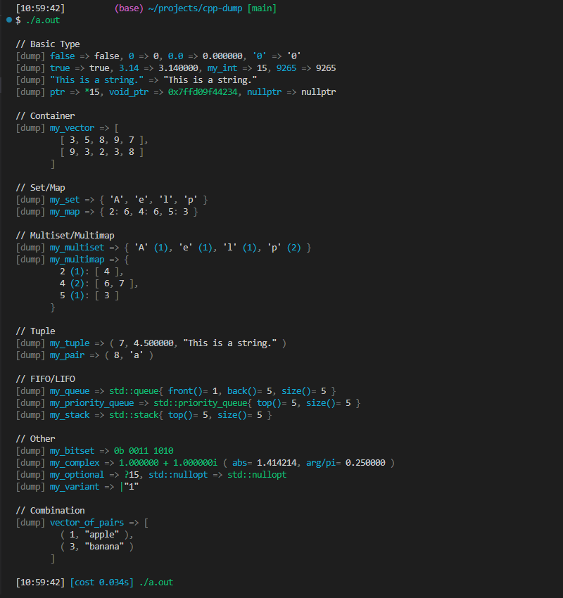
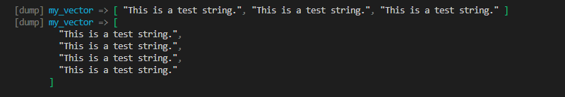
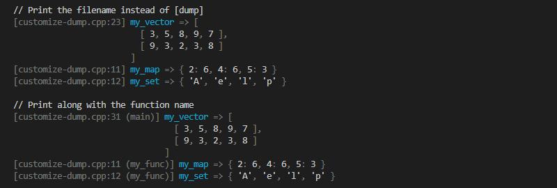
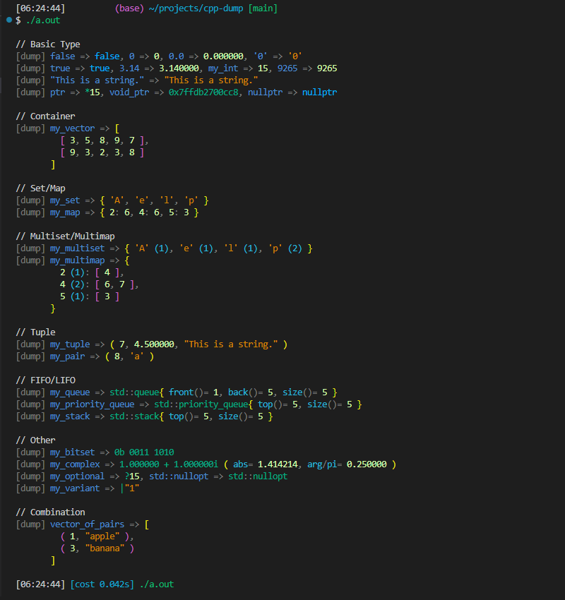
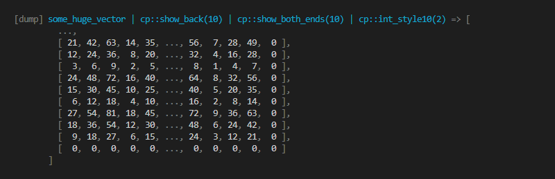
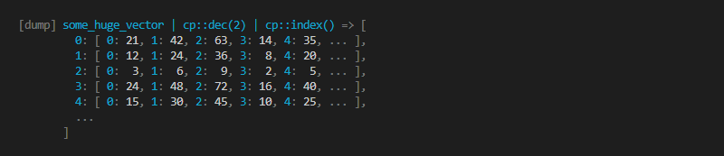
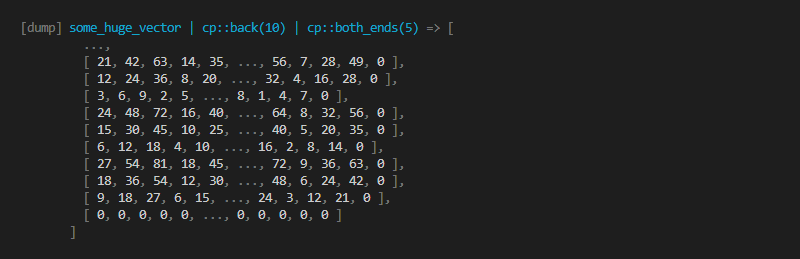
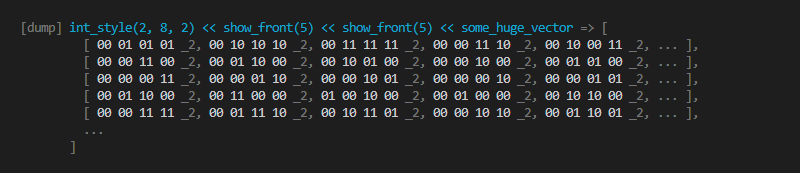

# cpp-dump

[日本語記事はこちら！](https://zenn.dev/sassan/articles/19db660e4da0a4)  
[I Made a C++ Version of Python print() Function (DEV article)](https://dev.to/philip82148/i-made-a-c-version-of-consolelog-o88)

## Overview

cpp-dump is a C++ library for debugging purposes that can print any variable, including user types.

This library has the following features:

- Prints string representations of a wide variety of types to the standard error output (or other configurable outputs). This includes multidimensional arrays, (multi)maps, and (multi)sets, and even complex numbers, error objects, etc.
- Automatically indents so that the output fits into the maximum line width.
- Customizable output color.
- The file name, line, and function name can also be attached to the log output.
- Header-only library, no build or dependencies required.
- Can print even user-defined types by using macros or defining operators.
- The string representation of variables is similar to JavaScript, Python, and C++ syntax.

## Introduction

You can print variables of a wide variety of types by passing them to the `cpp_dump(expressions...)` macro.  
[See Full Example Code](./readme/introduction.cpp)

```cpp
std::vector<std::vector<int>> my_vector{{3, 5, 8, 9, 7}, {9, 3, 2, 3, 8}};
cpp_dump(my_vector);
```


## Features

### A wide variety of supported types

cpp-dump supports a wide variety of types. Also, it supports nested containers of any combination of the types. Their string representation is similar to JavaScript, Python, and C++ syntax, which is easy to read.  
[See All Supported Types](#supported-types)  
[See Full Example Code](./readme/supports-various-types.cpp)

```cpp
// See the full example code for the definitions of the variables.
std::clog << "\n// Basic Type" << std::endl;
cpp_dump(false, 0, 0.0, '0'); cpp_dump(true, 3.14, my_int, 9265);
cpp_dump("This is a string."); cpp_dump(ptr, void_ptr, nullptr);

std::clog << "\n// Container" << std::endl;
cpp_dump(my_vector);

std::clog << "\n// Set/Map" << std::endl;
cpp_dump(my_set); cpp_dump(my_map);

std::clog << "\n// Multiset/Multimap" << std::endl;
cpp_dump(my_multiset); cpp_dump(my_multimap);

std::clog << "\n// Tuple" << std::endl;
cpp_dump(my_tuple); cpp_dump(my_pair);

std::clog << "\n// FIFO/LIFO" << std::endl;
cpp_dump(my_queue); cpp_dump(my_priority_queue); cpp_dump(my_stack);

std::clog << "\n// Other" << std::endl;
cpp_dump(my_bitset); cpp_dump(my_complex);
cpp_dump(my_optional, std::nullopt); cpp_dump(my_variant);

std::clog << "\n// Combination" << std::endl;
cpp_dump(vector_of_pairs);
```



### Auto indent

cpp-dump automatically indents so that the output does not exceed the maximum width. [See Full Example Code](./readme/auto-indent.cpp)

```cpp
cpp_dump(my_vector);
my_vector.push_back("This is a test string.");
cpp_dump(my_vector);
```



### Filename and line can be printed instead of `[dump]`

If you want to print the filename and line instead of `[dump]`, use the following code. The `cpp_dump()` macro will automatically detect and print the filename and the line. You can attach the function name, too. See [Customize `[dump]`](#customize-dump) for details.  
[See Full Example Code](./readme/customize-dump.cpp)

```cpp
// Print the filename and line instead of [dump]
CPP_DUMP_SET_OPTION(log_label_func, cp::log_label::filename());
// Print along with the function name
CPP_DUMP_SET_OPTION(log_label_func, cp::log_label::filename(true));
```



### Customizable output color

You can modify the escape sequences to change the colors of the output using the following code.  
[See Full Example Code](./readme/customizable-colors.cpp)

```cpp
// Use more colors
CPP_DUMP_SET_OPTION(es_value, (cp::es_value_t{
  "\e[02m",  // log: dark
  "\e[34m",  // expression: blue
  "\e[36m",  // reserved: cyan
  "\e[36m",  // number: cyan
  "\e[36m",  // character: cyan
  "\e[02m",  // op: dark
  "\e[32m",  // identifier:  green
  "\e[36m",  // member: cyan
  "",        // unsupported: default
  {
    "\e[33m",  // bracket_by_depth[0]: yellow
    "\e[35m",  // bracket_by_depth[1]: magenta
    "\e[36m",  // bracket_by_depth[2]: cyan
  },
}));

// Different colors for operators in class names and members (::, <>, (), etc...).
CPP_DUMP_SET_OPTION(detailed_class_es, true);
CPP_DUMP_SET_OPTION(detailed_member_es, true);
```



To turn off output coloring, use the following code.  
[See Full Example Code](./readme/no-es.cpp)

```cpp
// Turn off output coloring
CPP_DUMP_SET_OPTION(es_style, cpp_dump::es_style_t::no_es);
```

### Can print even user-defined types

If you want to print a user-defined type, you can enable the library to print it by using macros or defining an operator. The following is an example of the use of macros. See [How to print a user-defined type with cpp-dump](#how-to-print-a-user-defined-type-with-cpp-dump) for details.  
[See Full Example Code](./readme/user-defined-class2.cpp)

```cpp
CPP_DUMP_DEFINE_DANGEROUS_EXPORT_OBJECT(i, str());
```


## Advanced Feature

### Manipulators to change the display style

Using manipulators, you can set which and how many elements of an array/map/set and how the index of an array and integers will be displayed.  
See [Formatting with manipulators](#formatting-with-manipulators) for details.





## Requirement

- C++17 or higher.
- No build or dependencies are required since cpp-dump is a header-only library.

## Installation

```shell
git clone https://github.com/philip82148/cpp-dump
```

or

```shell
git submodule add https://github.com/philip82148/cpp-dump
```

Then

```cpp
#include "path/to/cpp-dump/dump.hpp"
```

## Configuration (as needed)

If you want to customize the library, you can write the configuration code as follows:

```cpp
// You can also write this in a header file -----------------------------------
#ifdef DEBUGGING
#include "path/to/cpp-dump/dump.hpp"
namespace cp = cpp_dump;
CPP_DUMP_SET_OPTION_IN_GLOBAL(max_line_width, 100);
#else
#define cpp_dump(...)
#endif
// You can also write this in a header file -----------------------------------

int main() {
  // To be continued...
}
```

If you want to configure the library within a function, use `CPP_DUMP_SET_OPTION()` instead.

```cpp
// You can also write this in a header file -----------------------------------
#ifdef DEBUGGING
#include "path/to/cpp-dump/dump.hpp"
namespace cp = cpp_dump;
#else
#define cpp_dump(...)
#define CPP_DUMP_SET_OPTION(...)
#endif
// You can also write this in a header file -----------------------------------

int main() {
  CPP_DUMP_SET_OPTION(max_line_width, 100);

  // To be continued...
}
```

### Configuration options

See also [Variables](#variables).

#### `max_line_width`

Type: `std::size_t` Default: `160`  
The maximum line width of the strings returned by `cpp_dump()` and `cpp_dump::export_var()`, which `cpp_dump()` internally uses to convert a variable into a string.

#### `max_depth`

Type: `std::size_t` Default: `4`  
The maximum number of times `cpp_dump::export_var()` is called recursively.

#### `max_iteration_count`

Type: `std::size_t` Default: `16`  
The maximum number of iterations of `cpp_dump::export_var()` over an iterator.  
Note that in a single call, `cpp_dump::export_var()` calls itself at most (`max_iteration_count`^(`max_depth`+1)-1)/(`max_iteration_count`-1)-1 times.

#### `enable_asterisk`

Type: `bool` Default: `false`  
Whether `cpp_dump::export_var()` prints types of the Asterisk category (See [Supported types](#supported-types)).

#### `print_expr`

Type: `bool` Default: `true`  
Whether `cpp_dump()` prints the expressions.

#### `log_label_func`

Type: `cpp_dump::log_label::log_label_func_t` Default: `cpp_dump::log_label::default_func`  
The function that returns the label that `cpp_dump()` prints at the beginning of the output.

#### `es_style`

Type: `enum class cpp_dump::es_style_t` Default `cpp_dump::es_style_t::original`  
The style of the escape sequences (the output coloring).

| Name        | Description                                                                                                                                                                |
| ----------- | -------------------------------------------------------------------------------------------------------------------------------------------------------------------------- |
| `original`  | Default.                                                                                                                                                                   |
| `by_syntax` | Use a color scheme closer to standard syntax highlighting. Pointers, bitsets, complexes, parentheses of member functions, and etc. are colored differently from `original` |
| `no_es`     | Turn off output coloring                                                                                                                                                   |

#### `es_value`

Type: `cpp_dump::es_value_t` Default: (Default constructor, see [Types](#types))  
The values of the escape sequences.

#### `detailed_class_es`

Type: `bool` Default: `false`  
If true, operators in class names (`::`, `<>`, etc...) will be colored differently.

#### `detailed_member_es`

Type: `bool` Default: `false`  
If true, operators in members (`()`, etc...) will be colored differently.

#### `cont_indent_style`

Type: `enum class cpp_dump::cont_indent_style_t` Default: `cpp_dump::cont_indent_style_t::when_nested`  
The style of indents of the Container, Set and Map categories (See [Supported types](#supported-types)).

| Name                     | Description                                                                                                                               |
| ------------------------ | ----------------------------------------------------------------------------------------------------------------------------------------- |
| `minimal`                | Don't indent unless the `max_line_width` is exceeded                                                                                      |
| `when_nested`            | Default. Always indent when the element/key/value type also falls into the Container/Set/Map/Tuple category.                              |
| `when_non_tuples_nested` | Always indent when the element/key/value type falls into the Container/Set/Map category, but don't when it falls into the Tuple category. |
| `always`                 | Always indent even if the Container/Set/Map is not nested.                                                                                |

## Usage

### Macros

```cpp
/**
 * Output string representations of expression(s) and result(s) to std::clog.
 * This is an alias of CPP_DUMP(expressions...).
 */
#define cpp_dump(expressions...)

/**
 * Output string representations of expression(s) and result(s) to std::clog.
 */
#define CPP_DUMP(expressions...)

/**
 * Make export_var() support type T.
 * Member functions to be displayed must be const.
 */
#define CPP_DUMP_DEFINE_EXPORT_OBJECT(T, members...)

/**
 * Make export_var() support every type that has the specified members.
 * Member functions to be displayed must be const.
 * Compile errors in this macro, such as ambiguous function calls, are never reported due to SFINAE.
 */
#define CPP_DUMP_DEFINE_DANGEROUS_EXPORT_OBJECT(members...)

/**
 * Make export_var() support enum T.
 */
#define CPP_DUMP_DEFINE_EXPORT_ENUM(T, members...)

/**
 * Set a value to a variable in cpp_dump namespace.
 * You can also assign values to the variables directly.
 */
#define CPP_DUMP_SET_OPTION(variable, value)

/**
 * Set a value to a variable in cpp_dump namespace.
 * Use this if you want to run it in the global namespace, meaning before the main starts.
 */
#define CPP_DUMP_SET_OPTION_IN_GLOBAL(variable, value)
```

### Types

```cpp
/**
 * Type of cpp_dump::es_style.
 * cpp_dump::export_var() supports this type.
 */
enum class cpp_dump::es_style_t { no_es, original, by_syntax };

/**
 * Type of cpp_dump::es_value.
 * cpp_dump::export_var() supports this type.
 */
struct cpp_dump::es_value_t {
  std::string log = "\e[02m";                           // dark
  std::string expression = "\e[36m";                    // cyan
  std::string reserved;                                 // default
  std::string number;                                   // default
  std::string character;                                // default
  std::string op = "\e[02m";                            // dark
  std::string identifier = "\e[32m";                    // green
  std::string member = "\e[36m";                        // cyan
  std::string unsupported = "\e[31m";                   // red
  std::vector<std::string> bracket_by_depth{"\e[02m"};  // dark
};

/**
 * Type of cpp_dump::cont_indent_style.
 * cpp_dump::export_var() supports this type.
 */
enum class cpp_dump::cont_indent_style_t
    { minimal, when_nested, when_non_tuples_nested, always };

using cpp_dump::log_label::log_label_func_t =
    std::function<std::string(std::string_view, std::size_t, std::string_view)>;
```

### Variables

```cpp
/**
 * Maximum line width of the strings returned by cpp_dump() and cpp_dump::export_var().
 */
inline std::size_t cpp_dump::max_line_width = 160;

/**
 * Maximum number of times cpp_dump::export_var() is called recursively.
 */
inline std::size_t cpp_dump::max_depth = 4;

/**
 * Maximum number of iterations of cpp_dump::export_var() over an iterator.
 * Note that in a single call, cpp_dump::export_var() calls itself at most
 * (max_iteration_count^(max_depth+1)-1)/(max_iteration_count-1)-1 times.
 */
inline std::size_t cpp_dump::max_iteration_count = 16;

/**
 * Whether cpp_dump() prints types of the Asterisk category (See 'Supported types').
 */
inline bool cpp_dump::enable_asterisk = false;

/**
 * Whether cpp_dump() prints the expressions.
 */
inline bool cpp_dump::print_expr = true;

/**
 * Function that returns the label that cpp_dump() prints at the beginning of the output.
 */
inline cpp_dump::log_label::log_label_func_t cpp_dump::log_label_func = cpp_dump::log_label::default_func;

/**
 * Style of the escape sequences (output coloring).
 */
inline cpp_dump::es_style_t cpp_dump::es_style = cpp_dump::es_style_t::original;

/**
 * Values of the escape sequences (output coloring).
 */
inline cpp_dump::es_value_t cpp_dump::es_value;

/**
 * If true, operators in class names (::, <>, etc...) will be colored differently.
 */
inline bool detailed_class_es = false;

/**
 * If true, operators in members ((), etc...) will be colored differently.
 */
inline bool detailed_member_es = false;

/**
 * Style of indents of the Container, Set and Map categories (See 'Supported types')
 */
inline cpp_dump::cont_indent_style_t cont_indent_style = cpp_dump::cont_indent_style_t::when_nested;
```

### Functions

```cpp
/**
 * Return a string representation of a variable.
 * cpp_dump() uses this function internally.
 */
template <typename T>
std::string cpp_dump::export_var(const T &value);

/**
 * cpp_dump() uses this function to print logs.
 * Define an explicit specialization with 'void' to customize this function.
 */
template <typename = void>
void cpp_dump::write_log(std::string_view output) {
  std::clog << output << std::endl;
}

// Manipulators (See 'Formatting with manipulators' for details.)
cpp_dump::front(std::size_t iteration_count = cpp_dump::max_iteration_count);
cpp_dump::middle(std::size_t iteration_count = cpp_dump::max_iteration_count);
cpp_dump::back(std::size_t iteration_count = cpp_dump::max_iteration_count);
cpp_dump::both_ends(std::size_t half_iteration_count = cpp_dump::max_iteration_count / 2);
cpp_dump::int_style(int base = 16, int digits = -1, int chunk = 2, bool space_fill = false);
cpp_dump::index();
cpp_dump::dec(int digits = -1, int chunk = 0);
cpp_dump::bin(int digits = -1, int chunk = 0);
cpp_dump::oct(int digits = -1, int chunk = 0);
cpp_dump::hex(int digits = -1, int chunk = 0);
cpp_dump::map_k(return_value_of_manipulator);
cpp_dump::map_v(return_value_of_manipulator);
cpp_dump::map_kv(return_value_of_manipulator_for_key, return_value_of_manipulator_for_value);

// See 'Customize "[dump]"'.
namespace cpp_dump::log_label {

std::string std::string default_func(std::string_view, std::size_t, std::string_view);
log_label_func_t line(bool show_func = false, int min_width = 0);
log_label_func_t basename(bool show_func = false, int min_width = 0);
log_label_func_t filename(bool show_func = false, int min_width = 0);
log_label_func_t fullpath(int substr_start, bool show_func = false, int min_width = 0);
log_label_func_t fixed_length(int min_width, int max_width,
    int substr_start, bool show_func = false);

}
```

### How to print a user-defined type with cpp-dump

There are three ways to enable the library to print a user type.

#### 1. Use CPP_DUMP_DEFINE_EXPORT_OBJECT() macro

This macro requires the user type to be accessible from the top level, but it is the safest and easiest way to enable `cpp_dump()` to print a user type.  
[See Full Example Code](./readme/user-defined-class.cpp)

```cpp
// Somewhere accessible from top level (not private or defined in a function)
struct class_A {
  int i;
  std::string str() const { return std::to_string(i); }
};

// At top level
// CPP_DUMP_DEFINE_EXPORT_OBJECT(type_name, members...)
CPP_DUMP_DEFINE_EXPORT_OBJECT(class_A, i, str());

// In a function
class_A my_class_A{10};
cpp_dump(my_class_A);
```


For enums, use CPP_DUMP_DEFINE_EXPORT_ENUM() macro.  
[See Full Example Code](./readme/user-defined-enum.cpp)

```cpp
// Somewhere accessible from top level (not private or defined in a function)
enum class enum_A { a, b, c };

// At top level
// CPP_DUMP_DEFINE_EXPORT_ENUM(enum_name, members...)
CPP_DUMP_DEFINE_EXPORT_ENUM(enum_A, enum_A::a, enum_A::b, enum_A::c);

// In a function
enum_A my_enum_A = enum_A::c;
cpp_dump(my_enum_A);
```


#### 2. Use CPP_DUMP_DEFINE_DANGEROUS_EXPORT_OBJECT() macro

This macro enables `cpp_dump()` to print any type with specified members.  
This macro doesn't require the user type to be accessible from the top level (or even the type name).

However, if you do not use this macro carefully, it might cause ambiguous function call errors.  
Moreover, the errors are never reported due to SFINAE, and the user type will remain unsupported.

If you use this macro only once, it won't cause ambiguous function call errors.  
[See Full Example Code](./readme/user-defined-class2.cpp)

```cpp
// At top level
// CPP_DUMP_DEFINE_DANGEROUS_EXPORT_OBJECT(members...)
CPP_DUMP_DEFINE_DANGEROUS_EXPORT_OBJECT(i, str());

// Anywhere
struct class_A {
  int i;
  std::string str() const { return std::to_string(i); }
};

// In a function
class_A my_class_A{10};
cpp_dump(my_class_A);
```


#### 3. Define `std::ostream& operator<<(std::ostream&, const T &)` operator

The last way is to define the operator `std::ostream& operator<<(std::ostream&, const T &)`.  
[See Full Example Code](./readme/user-defined-class3.cpp)

```cpp
// Somewhere accessible from top level (not private or defined in a function)
struct class_A {
  int i;
  std::string str() const { return std::to_string(i); }
};

// At top level
std::ostream &operator<<(std::ostream &os, const class_A &a) {
  os << "class_A{ i= " << a.i << ", str()= \"" << a.str() << "\" }";
  return os;
}

// In a function
class_A my_class_A{10};
cpp_dump(my_class_A);
```


### Customize `[dump]`

Assigning a function to `cpp_dump::log_label_func`, you can customize `[dump]`.  
cpp-dump has some functions that create a function to assign to `cpp_dump::log_label_func`, so you don't have to make your own function.

```cpp
namespace cpp_dump::log_label {

using log_label_func_t =
    std::function<std::string(std::string_view fullpath, std::size_t line, std::string_view func_name)>;

// Default function assigned to cpp_dump::log_label_func.
std::string default_func(std::string_view, std::size_t, std::string_view) {
  return "[dump] ";
}

// Functions that create a function that can be assigned to cpp_dump::log_label_func.
log_label_func_t line(bool show_func = false, int min_width = 0);
log_label_func_t basename(bool show_func = false, int min_width = 0);
log_label_func_t filename(bool show_func = false, int min_width = 0);
log_label_func_t fullpath(int substr_start, bool show_func = false, int min_width = 0);
log_label_func_t fixed_length(int min_width, int max_width,
    int substr_start, bool show_func = false);

}

inline cpp_dump::log_label::log_label_func_t cpp_dump::log_label_func = cpp_dump::log_label::default_func;
```

### Formatting with manipulators

[See Full Example Code](./readme/formatting-with-manipulators.cpp)

Using manipulators, you can set which and how many elements of an array/map/set will be displayed.  
See [front, middle, back, both_ends manipulators](#front-middle-back-both_ends-manipulators) for details.

```cpp
// Show the last 10 elements for the 1st dimension, the first 5 and the last 5 for the 2nd dimension.
cpp_dump(some_huge_vector | cp::back(10) | cp::both_ends(5));
```



And you can set how integers are displayed with manipulators.  
See [int_style manipulators](#int_style-manipulators) for details.

```cpp
// Show integers in binary, minimum 8 digits, separated by every 2 characters.
cpp_dump(some_huge_vector | cp::bin(8, 2) | cp::front(5) | cp::front(5));
```



```cpp
// Show integers in decimal, minimum 2 digits.
cpp_dump(some_huge_vector | cp::back(10) | cp::both_ends(5) | cp::dec(2));
```


Furthermore, you can show the indexes of an array by using a manipulator.  
See [index manipulator](#index-manipulator) for details.

```cpp
CPP_DUMP_SET_OPTION(max_iteration_count, 5);

// Show the indexes of the vector.
cpp_dump(some_huge_vector | cp::dec(2) | cp::index());
```


#### front, middle, back, both_ends manipulators

```cpp
cpp_dump::front(std::size_t iteration_count = cpp_dump::max_iteration_count);
cpp_dump::middle(std::size_t iteration_count = cpp_dump::max_iteration_count);
cpp_dump::back(std::size_t iteration_count = cpp_dump::max_iteration_count);
cpp_dump::both_ends(std::size_t half_iteration_count = cpp_dump::max_iteration_count / 2);

// Example
cpp_dump(cp::front() << cp::back() << variable);
cpp_dump(variable | cp::front() | cp::back());
```

The further left manipulator will act on the more outside dimensions of the array/map/set.  
**Caution:**  
**These manipulators other than front() calculate the container's size. Containers whose size cannot be calculated with std::size() will cost O(N) in computation. In particular, passing an infinite sequence to these manipulators will result in an infinite loop.**

#### int_style manipulators

```cpp
cpp_dump::int_style(int base = 16, int digits = -1, int chunk = 2, bool space_fill = false);
cpp_dump::dec(int digits = -1, int chunk = 0) {
  return int_style(10, digits, chunk, true);
}
cpp_dump::bin(int digits = -1, int chunk = 0) {
  return int_style(2, digits, chunk, false);
}
cpp_dump::oct(int digits = -1, int chunk = 0) {
  return int_style(8, digits, chunk, false);
}
cpp_dump::hex(int digits = -1, int chunk = 0) {
  return int_style(16, digits, chunk, false);
}

// Example
cpp_dump(... << cp::int_style() << ... << variable);
cpp_dump(variable | ... | cp::int_style() | ...);
```

Parameter `base` of `int_style()` supports values of 2, 8, 10, 16. For other values, this manipulator resets the effects of the previous `int_style()` manipulators.  
`digits` supports values of `digits` >= 0 and `digits` <= 'the maximum digits', where 'the maximum digits' is the maximum number of digits that can be represented by the type for the given `base`. For other values, it is treated as `digits` = 'the maximum digits'.  
`chunk` supports values of `chunk` >= 0. For other values, it is treated as `chunk` = 0.  
Unlike `front` and other manipulators, `int_style()` manipulator acts on all integers in the variable. (The order is irrelevant.)  
`dec(...)`, `bin(...)`, `oct(...)`, `hex(...)` are aliases of `int_style(...)`

#### index manipulator

```cpp
cpp_dump::index();

// Example
cpp_dump(... << cp::index() << ... << variable);
cpp_dump(variable | ... | cp::index() | ...);
```

Like `int_style` manipulator, this manipulator acts on all sequence containers in the variable. (The order is irrelevant.)  
It does not affect maps/sets.

#### map\_\* manipulators

```cpp
cpp_dump::map_k(return_value_of_manipulator);
cpp_dump::map_v(return_value_of_manipulator);
cpp_dump::map_kv(return_value_of_manipulator_for_key, return_value_of_manipulator_for_value);

// Example
cpp_dump(cp::front() << cp::map_kv(cp::hex(), cp::back()) << map);
cpp_dump(map | cp::front() | cp::map_kv(cp::hex(), cp::back()));
```

These manipulators act on (multi)maps.  
In this example, the keys are displayed in hexadecimal, and if the values are iterable, the front part of the values is omitted.

### Change the output destination from the standard error output

```cpp
namespace cpp_dump {

template <>
void write_log(std::string_view output) {
  elsewhere << output << std::endl;
}

}  // namespace cpp_dump
```

### For competitive programming use

```cpp
#ifdef DEFINED_ONLY_IN_LOCAL
#include "./cpp-dump/dump.hpp"
#define dump(...) cpp_dump(__VA_ARGS__)
namespace cp = cpp_dump;
#else
#define dump(...)
#define CPP_DUMP_SET_OPTION(...)
#define CPP_DUMP_DEFINE_EXPORT_OBJECT(...)
#define CPP_DUMP_DEFINE_EXPORT_ENUM(...)
#define CPP_DUMP_DEFINE_DANGEROUS_EXPORT_OBJECT(...)
#endif

#include <bits/stdc++.h>

#define rep(i, n) for (int i = 0; i < (int)(n); ++i)

using namespace std;

int main() {
  CPP_DUMP_SET_OPTION(max_line_width, 80);
  CPP_DUMP_SET_OPTION(log_label_func, cp::log_label::filename());
  CPP_DUMP_SET_OPTION(enable_asterisk, true);

  int N;
  cin >> N;

  vector<int> X(N);
  rep(i, N) { cin >> X[i]; }
  dump(X);

  // To be continued...
}
```

Then

```shell
g++ ./main.cpp -D DEFINED_ONLY_IN_LOCAL
```

or

```shell
clang++ ./main.cpp -D DEFINED_ONLY_IN_LOCAL
```

## Supported types

cpp_dump() prints variables recursively, so they can dump nested variables of any combination of types in the table below.

| Category      | Type T is supported if ...                                                                                                                                                                                                                                                                            | Example                                           |
| ------------- | ----------------------------------------------------------------------------------------------------------------------------------------------------------------------------------------------------------------------------------------------------------------------------------------------------- | ------------------------------------------------- |
| Arithmetic    | `std::is_arithmetic_v<T> == true`                                                                                                                                                                                                                                                                     | `bool`, `char`, `int`, `long`, `float`, `double`  |
| String        | T is convertible to `std::string_view`                                                                                                                                                                                                                                                                | `std::string`, `const char *`, `std::string_view` |
| Container     | T is compatible with the range-based for loop                                                                                                                                                                                                                                                         | `std::vector`, `std::array`, C-style arrays       |
| Map           | T is either `std::map`, `std::unordered_map`, `std::multimap`, or `std::unordered_multimap`                                                                                                                                                                                                           |                                                   |
| Set           | T is either `std::set`, `std::unordered_set`, `std::multiset`, or `std::unordered_multiset`                                                                                                                                                                                                           |                                                   |
| Tuple         | T is compatible with `std::tuple_size_v<T>`                                                                                                                                                                                                                                                           | `std::tuple`, `std::pair`                         |
| FIFO/LIFO     | T is either `std::queue`, `std::priority_queue`, or `std::stack`                                                                                                                                                                                                                                      |                                                   |
| Pointer       | T is a pointer or smart pointer                                                                                                                                                                                                                                                                       | `int *`, `std::shared_ptr`, `std::unique_ptr`     |
| Reference     | T is `std::reference_wrapper`                                                                                                                                                                                                                                                                         |                                                   |
| Exception     | T is convertible to `std::exception`                                                                                                                                                                                                                                                                  |                                                   |
| Other         | T is either `std::bitset`, `std::complex`, `std::optional`, `std::variant`, `std::type_info`, `std::type_index` or `std::source_location`(C++20 or higher and g++ and MSVC only)                                                                                                                      |                                                   |
| User-defined  | `CPP_DUMP_DEFINE_EXPORT_OBJECT(T, members...);` is at top level and the member functions to be displayed is const.                                                                                                                                                                                    |                                                   |
| Enum          | `CPP_DUMP_DEFINE_EXPORT_ENUM(T, members...);` is at top level.                                                                                                                                                                                                                                        |                                                   |
| Ostream       | All of the above are not satisfied, `std::is_function_v<T> == false && std::is_member_pointer_v<T> == false`, and the function `std::ostream& operator<<(std::ostream&, const T &)` is defined. **The string representation of T must not be an empty string** (This makes manipulators unsupported). |                                                   |
| User-defined2 | All of the above are not satisfied, T has all members specified by just one `CPP_DUMP_DEFINE_DANGEROUS_EXPORT_OBJECT(members...);` at top level, and the member functions to be displayed is const.                                                                                                   |                                                   |
| Asterisk      | All of the above are not satisfied, `cpp_dump::enable_asterisk == true` and the function `TypeExceptT operator*(const T &)` or the const member function `TypeExceptT T::operator*() const` is defined.                                                                                               | Iterators                                         |

### Display example

See also the image in the section [A wide variety of supported types](#a-wide-variety-of-supported-types).

```console
# Arithmetic
true, 'c', 1, 3.140000

# String
"A normal string"
`A string with '"' or newline(s)`

# Container
[ value1, value2, ... ]

# Map
{ key1: value1, key2: value2, ... },
{ key1 (multiplicity1): [ value1a, value1b, ... ], key2 (multiplicity2): [ ... ], ... }

# Set
{ value1, value2, ... },
{ value1 (multiplicity1), value2 (multiplicity2), ... }

# Tuple
( value1, value2, ... )

# FIFO/LIFO
std::queue{ front()= value, back()= value, size()= integer }

# Pointer
*value
nullptr
0x7fff2246c4d8
# (The address will be displayed when the pointer type is void *
#  or the type the pointer points to is not supported.)

# Reference
true, 'c', 1, 3.140000
# (No change)

# Exception
std::logic_error{ what()= "Error Message" }

# Asterisk
*value
```

For other categories, see the image(s) in the section...

Other -> [A wide variety of supported types](#a-wide-variety-of-supported-types)  
User-defined, Enum -> [How to print a user-defined type with cpp-dump](#how-to-print-a-user-defined-type-with-cpp-dump)
