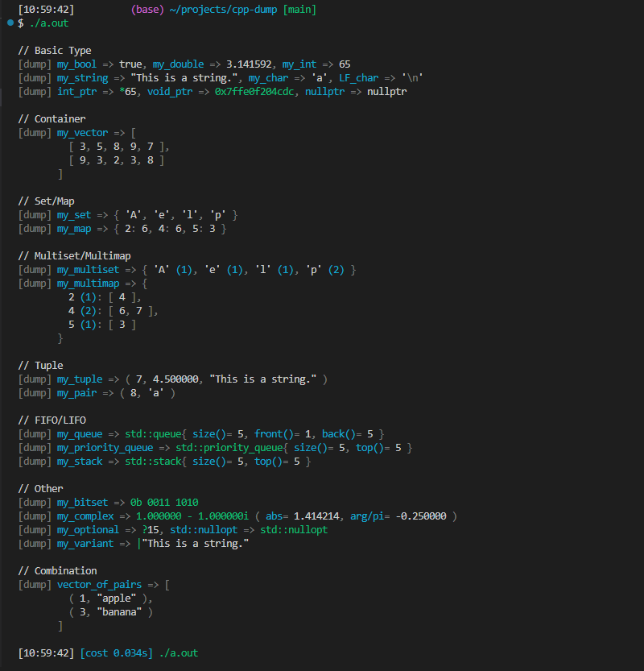

# cpp-dump

cpp-dump is an all-round dump function library for C++ that supports even user-defined classes.

## Introduction

cpp-dump has a macro version and a function version of dump functions.

### CPP_DUMP(expressions...) macro

This macro dumps variable(s) along with expression(s). [See Full Example Code](./readme/macro-version.cpp)

```cpp
std::vector<std::vector<int>> vector{{3, 5, 8, 9, 7}, {9, 3, 2, 3, 8}};
CPP_DUMP(vector);
```


### cpp_dump::dump(args...) function

This function simply dumps variable(s). [See Full Example Code](./readme/function-version.cpp)

```cpp
std::vector<std::vector<int>> vector{{3, 5, 8, 9, 7}, {9, 3, 2, 3, 8}};
cpp_dump::dump(vector);
```


## Features

Both dump functions have the following features.

### A wide variety of supported types

[See All Supported Types](#supported-types)  
[See Full Example Code](./readme/supports-various-types.cpp)

```cpp
std::clog << "\n// Basic Type" << std::endl;
CPP_DUMP(false, 0, 0.0, '0'); CPP_DUMP(true, 3.14, a, 9265);
CPP_DUMP("This is a string."); CPP_DUMP(ptr, void_ptr, nullptr);

std::clog << "\n// Container" << std::endl;
CPP_DUMP(vector);

std::clog << "\n// Set/Map" << std::endl;
CPP_DUMP(set); CPP_DUMP(map);

std::clog << "\n// Multiset/Multimap" << std::endl;
CPP_DUMP(multiset); CPP_DUMP(multimap);

std::clog << "\n// Tuple" << std::endl;
CPP_DUMP(tuple); CPP_DUMP(pair);

std::clog << "\n// FIFO/LIFO" << std::endl;
CPP_DUMP(queue); CPP_DUMP(pq); CPP_DUMP(stack);

std::clog << "\n// Other" << std::endl;
CPP_DUMP(bitset); CPP_DUMP(complex);
CPP_DUMP(optional, std::nullopt); CPP_DUMP(variant);
```



### Auto indent

Automatically indent so that the output does not exceed the maximum width. [See Full Example Code](./readme/auto-indent.cpp)

```cpp
CPP_DUMP(vector);
vector.push_back("This is a test string.");
CPP_DUMP(vector);
```


### User-defined types can also be supported by using macros

#### User-defined class

[See Full Example Code](./readme/user-defined-class.cpp)

```cpp
//  At top level
struct my_class {
  int i;
  std::string str() const { return std::to_string(i); }
};
CPP_DUMP_DEFINE_EXPORT_OBJECT(my_class, i, str());

// In main() or some function
my_class new_my_class{10};
CPP_DUMP(new_my_class);
```


#### Enum

[See Full Example Code](./readme/user-defined-enum.cpp)

```cpp
//  At top level
enum class my_enum { a, b, c };
CPP_DUMP_DEFINE_EXPORT_ENUM(my_enum, my_enum::a, my_enum::b, my_enum::c);

// In main() or some function
my_enum new_my_enum = my_enum::c;
CPP_DUMP(new_my_enum);
```


## Installation

```shell
git clone https://github.com/philip82148/cpp-dump
```

or

```shell
git submodule add https://github.com/philip82148/cpp-dump
```

## Usage

```cpp
#include "path/to/cpp-dump/dump.hpp"
```

### Macros

```cpp
/**
 * Output string representations of expression(s) and result(s) to std::clog.
 */
#define CPP_DUMP(expressions...)

/**
 * Make export_var() support type T.
 * Member functions to be displayed must be const.
 */
#define CPP_DUMP_DEFINE_EXPORT_OBJECT(T, members...)

/**
 * Make export_var() support enum T.
 */
#define CPP_DUMP_DEFINE_EXPORT_ENUM(T, members...)

/**
 * Set a value to a variable in cpp_dump namespace.
 */
#define CPP_DUMP_SET_OPTION(variable, value)
```

### Variables

```cpp
/**
 * Maximum line width of output strings of cpp_dump::export_var().
 */
inline size_t cpp_dump::max_line_width = 160;

/**
 * Maximum number of times cpp_dump::export_var() is applied recursively.
 */
inline size_t cpp_dump::max_depth = 5;

/**
 * Maximum number of times cpp_dump::export_var() iterates over an iterator.
 * Note that in a single call, export_var() calls itself at most
 * (max_iteration_count^max_depth-1)/(max_iteration_count-1)-1 times.
 */
inline size_t cpp_dump::max_iteration_count = 16;
```

### Functions

```cpp
/**
 * Output string representation(s) of variable(s) to std::clog.
 */
template <typename... Args>
void cpp_dump::dump(const Args &...args);

/**
 * Return a string representation of a variable.
 * CPP_DUMP() and cpp_dump::dump() use this function internally.
 */
template <typename T>
std::string cpp_dump::export_var(const T &value);
```

### Meta function

```cpp
/**
 * Check if export_var() supports type T (export_var() returns "Unsupported Type" if false).
 */
template <typename T>
inline constexpr bool cpp_dump::is_exportable;
```

## For competitive programming use

```cpp
#ifdef DEFINED_ONLY_IN_LOCAL
#include "./cpp-dump/dump.hpp"
#define dump(...) CPP_DUMP(__VA_ARGS__)
#else
#define dump(...)
#define CPP_DUMP_SET_OPTION(...)
#define CPP_DUMP_DEFINE_EXPORT_OBJECT(...)
#define CPP_DUMP_DEFINE_EXPORT_ENUM(...)
#endif

#include <bits/stdc++.h>

#define rep(i, n) for (int i = 0; i < (int)(n); ++i)

using namespace std;

int main() {
  CPP_DUMP_SET_OPTION(max_line_width, 80);

  int N;
  cin >> N;

  vector<int> X(N);
  rep(i, N) { cin >> X[i]; }
  dump(X);
}
```

## Supported types

| Category     | Type T is supported if ...                                                                                                                                         | Example                                           |
| ------------ | ------------------------------------------------------------------------------------------------------------------------------------------------------------------ | ------------------------------------------------- |
| Arithmetic   | `std::is_arithmetic_v<T> == true`                                                                                                                                  | `bool`, `char`, `int`, `long`, `float`, `double`  |
| String       | T is convertible to `std::string_view`                                                                                                                             | `std::string`, `const char *`, `std::string_view` |
| Container    | T is compatible with the range-based for loop                                                                                                                      | `std::vector`, `std::array`, C-style arrays       |
| Map          | T is either `std::map`, `std::unordered_map`, `std::multimap`, or `std::unordered_multimap`                                                                        |                                                   |
| Set          | T is either `std::set`, `std::unordered_set`, `std::multiset`, or `std::unordered_multiset`                                                                        |                                                   |
| Tuple        | T is either `std::tuple` or `std::pair`                                                                                                                            |                                                   |
| FIFO/LIFO    | T is either `std::queue`, `std::priority_queue`, or `std::stack`                                                                                                   |                                                   |
| Pointer      | T is a pointer or smart pointer                                                                                                                                    | `int *`, `std::shared_ptr`, `std::unique_ptr`     |
| Reference    | T is `std::reference_wrapper`                                                                                                                                      |                                                   |
| Exception    | T is convertible to `std::exception`                                                                                                                               |                                                   |
| Other        | T is either `std::bitset`, `std::complex`, `std::optional`, or `std::variant`                                                                                      |                                                   |
| User-defined | `CPP_DUMP_DEFINE_EXPORT_OBJECT(T, members...);` is at top level and the member functions to be displayed is const.                                                 |                                                   |
| Enum         | `CPP_DUMP_DEFINE_EXPORT_ENUM(T, members...);` is at top level.                                                                                                     |                                                   |
| Asterisk     | All of the above are not satisfied and the function `TypeExceptT operator*(const T &)` or the const member function `TypeExceptT T::operator*() const` is defined. | Iterators                                         |

### Display example

See also the image in the section ["A wide variety of supported types"](#a-wide-variety-of-supported-types).

```console
# Arithmatic
true, 'c', 1, 3.140000

# String
"A normal string"
`A string with '"' or newline(s)`

# Container
[ value1, value2, ... ]

# Map
{ key1: value1, key2: value2, ... },
{ key1 (multiplicity1): [ value1a, value1b, ... ], key2 (multiplicity2): [ ... ], ... }

# Set
{ value1, value2, ... },
{ value1 (multiplicity1), value2 (multiplicity2), ... }

# Tuple
( value1, value2, ... )

# FIFO/LIFO
std::queue{ front()= value, size()= integer }

# Pointer
*value
nullptr
0x7fff2246c4d8
# (The address will be displayed when the type the pointer points to is not supported or void *.)

# Reference
true, 'c', 1, 3.140000
# (No change)

# Exception
std::logic_error{ what()= "Error Message" }

# Asterisk
*value
```

For other categories, see the image in the section...

Other -> [A wide variety of supported types](#a-wide-variety-of-supported-types)  
User-defined -> [User-defined class](#user-defined-class)  
Enum -> [Enum](#enum)
