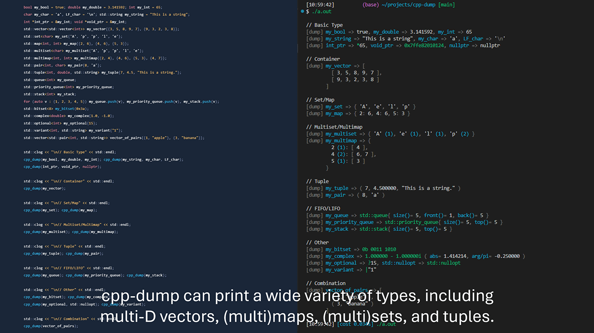
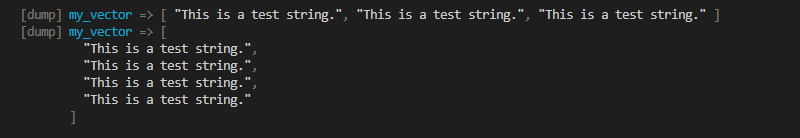
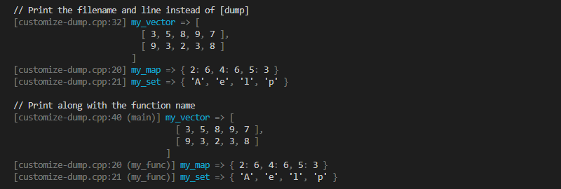
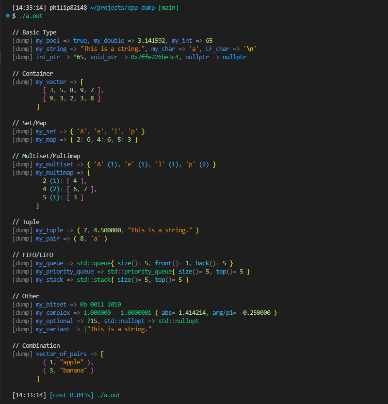
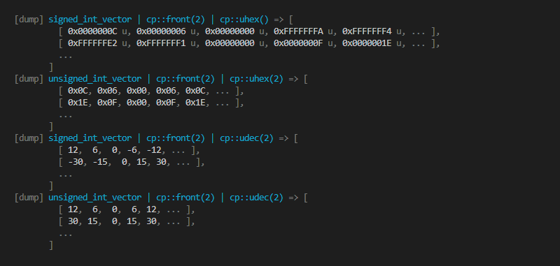
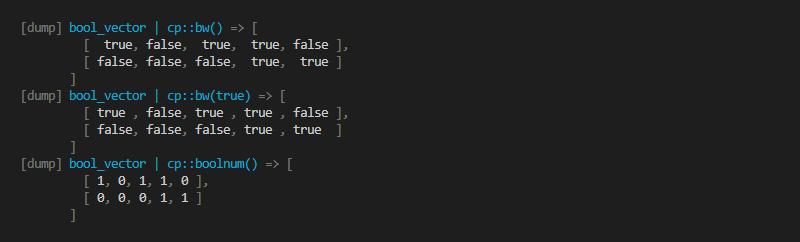

# cpp-dump <!-- omit in toc -->

  
_This is an animated GIF._

**cpp-dump is a C++ library for printing variables of any type for debugging.**

Python has `print()`, JavaScript has `console.log()`, and PHP has `var_dump()` — functions that print variables of any type and are useful for debugging when you want a quick way to inspect variables. But what about C++? Enter `cpp_dump(...)`. cpp-dump is a library that automatically formats and prints variables of any type. With features like auto-indentation, colored output, string representations similar to JavaScript, Python, and C++, and over 20 manipulators, cpp-dump is equipped with everything you need to effortlessly and clearly print variables.

Key points:

- cpp-dump can print a wide variety of types, including multi-D vectors, (multi)maps, (multi)sets, and tuples.
- cpp-dump has an auto-indentation feature. The output fits into the maximum line width, and nested containers are formatted for readability.
- The string representation of variables is similar to JavaScript, Python, and C++ syntax. The output is readable without being overloaded with information. (You can add more details using manipulators if you want.)
- Customizable colored output is available. You can achieve syntax highlighting similar to that of IDEs.
- With over 20 manipulators, you can easily change the format or add information to the output.
- By using macros, cpp-dump supports user-defined types as well. There is no need to write new functions for printing.
- cpp-dump is a header-only library. No build or dependencies are required!

[日本語記事はこちら！](https://zenn.dev/sassan/articles/19db660e4da0a4)

## Table of Contents <!-- omit in toc -->

- [Introduction](#introduction)
- [Features](#features)
  - [A wide variety of supported types](#a-wide-variety-of-supported-types)
  - [Auto indent](#auto-indent)
  - [Filename and line can be printed instead of `[dump]`](#filename-and-line-can-be-printed-instead-of-dump)
  - [Customizable output color](#customizable-output-color)
  - [Can print even user-defined types](#can-print-even-user-defined-types)
- [Advanced Feature](#advanced-feature)
  - [20+ Manipulators to change the display style](#20-manipulators-to-change-the-display-style)
- [Requirement](#requirement)
- [Installation](#installation)
  - [Simplest solution](#simplest-solution)
  - [With CMake](#with-cmake)
    - [Run `cmake --install` to copy the headers to `/usr/local/include/` or equivalent](#run-cmake---install-to-copy-the-headers-to-usrlocalinclude-or-equivalent)
    - [Use `FetchContent`](#use-fetchcontent)
- [Configuration (as needed)](#configuration-as-needed)
  - [Configuration options](#configuration-options)
    - [`max_line_width`](#max_line_width)
    - [`max_depth`](#max_depth)
    - [`max_iteration_count`](#max_iteration_count)
    - [`cont_indent_style`](#cont_indent_style)
    - [`enable_asterisk`](#enable_asterisk)
    - [`print_expr`](#print_expr)
    - [`log_label_func`](#log_label_func)
    - [`es_style`](#es_style)
    - [`es_value`](#es_value)
    - [`detailed_class_es`](#detailed_class_es)
    - [`detailed_member_es`](#detailed_member_es)
    - [`detailed_number_es`](#detailed_number_es)
- [Detailed usage](#detailed-usage)
  - [Macros](#macros)
  - [Types](#types)
  - [Variables](#variables)
  - [Functions](#functions)
  - [How to print a user-defined type with cpp-dump](#how-to-print-a-user-defined-type-with-cpp-dump)
    - [Method 1. Use `CPP_DUMP_DEFINE_EXPORT_OBJECT()` macro](#method-1-use-cpp_dump_define_export_object-macro)
    - [Method 2. Use `CPP_DUMP_DEFINE_EXPORT_OBJECT_GENERIC()` macro](#method-2-use-cpp_dump_define_export_object_generic-macro)
    - [Method 3. Define `std::ostream& operator<<(std::ostream&, const T &)` operator](#method-3-define-stdostream-operatorstdostream-const-t--operator)
  - [Customize `[dump]`](#customize-dump)
  - [Formatting with manipulators](#formatting-with-manipulators)
    - [How to use manipulators](#how-to-use-manipulators)
    - [`front()`, `middle()`, `back()`, `both_ends()` manipulators](#front-middle-back-both_ends-manipulators)
    - [`index()` manipulator](#index-manipulator)
    - [`int_style()` and its alias manipulators](#int_style-and-its-alias-manipulators)
    - [`format()` manipulator](#format-manipulator)
    - [`bw()`, `boolnum()` manipulators](#bw-boolnum-manipulators)
    - [`stresc()` manipulator](#stresc-manipulator)
    - [`charhex()` manipulator](#charhex-manipulator)
    - [`addr()` manipulator](#addr-manipulator)
    - [`map_*()` manipulators](#map_-manipulators)
  - [Change the output destination from the standard error output](#change-the-output-destination-from-the-standard-error-output)
  - [How to pass complex expressions to `cpp_dump(...)`](#how-to-pass-complex-expressions-to-cpp_dump)
    - [Expressions with commas](#expressions-with-commas)
    - [Variadic template arguments](#variadic-template-arguments)
  - [For competitive programming use](#for-competitive-programming-use)
- [Supported types](#supported-types)
  - [Display example](#display-example)

## Introduction

You can print variables of a wide variety of types by passing them to the `cpp_dump(expressions...)` macro.  
[See Full Example Code](./readme/introduction.cpp)

```cpp
std::vector<std::vector<int>> my_vector{{3, 5, 8, 9, 7}, {9, 3, 2, 3, 8}};
cpp_dump(my_vector);
```


## Features

### A wide variety of supported types

cpp-dump supports a wide variety of types, including multi-D vectors, (multi)maps, (multi)sets, and tuples.  
Their string representation is similar to JavaScript, Python, and C++ syntax, which is easy to read.  
[See All Supported Types](#supported-types)  
[See Full Example Code](./readme/supports-various-types.cpp)

```cpp
bool my_bool = true; double my_double = 3.141592; int my_int = 65;
char my_char = 'a', LF_char = '\n'; std::string my_string = "This is a string.";
int *int_ptr = &my_int; void *void_ptr = &my_int;
std::vector<std::vector<int>> my_vector{{3, 5, 8, 9, 7}, {9, 3, 2, 3, 8}};
std::set<char> my_set{'A', 'p', 'p', 'l', 'e'};
std::map<int, int> my_map{{2, 6}, {4, 6}, {5, 3}};
std::multiset<char> my_multiset{'A', 'p', 'p', 'l', 'e'};
std::multimap<int, int> my_multimap{{2, 4}, {4, 6}, {5, 3}, {4, 7}};
std::pair<int, char> my_pair{8, 'a'};
std::tuple<int, double, std::string> my_tuple{7, 4.5, "This is a string."};
std::queue<int> my_queue;
std::priority_queue<int> my_priority_queue;
std::stack<int> my_stack;
for (auto v : {1, 2, 3, 4, 5}) my_queue.push(v), my_priority_queue.push(v), my_stack.push(v);
std::bitset<8> my_bitset(0x3a);
std::complex<double> my_complex{1.0, -1.0};
std::optional<int> my_optional{15};
std::variant<int, std::string> my_variant{"This is a string."};
std::vector<std::pair<int, std::string>> vector_of_pairs{{1, "apple"}, {3, "banana"}};

std::clog << "\n// Basic Type" << std::endl;
cpp_dump(my_bool, my_double, my_int); cpp_dump(my_string, my_char, LF_char);
cpp_dump(int_ptr, void_ptr, nullptr);

std::clog << "\n// Container" << std::endl;
cpp_dump(my_vector);

std::clog << "\n// Set/Map" << std::endl;
cpp_dump(my_set); cpp_dump(my_map);

std::clog << "\n// Multiset/Multimap" << std::endl;
cpp_dump(my_multiset); cpp_dump(my_multimap);

std::clog << "\n// Tuple" << std::endl;
cpp_dump(my_tuple); cpp_dump(my_pair);

std::clog << "\n// FIFO/LIFO" << std::endl;
cpp_dump(my_queue); cpp_dump(my_priority_queue); cpp_dump(my_stack);

std::clog << "\n// Other" << std::endl;
cpp_dump(my_bitset); cpp_dump(my_complex);
cpp_dump(my_optional, std::nullopt); cpp_dump(my_variant);

std::clog << "\n// Combination" << std::endl;
cpp_dump(vector_of_pairs);
```


### Auto indent

cpp-dump automatically indents so that the output does not exceed the maximum width.  
Additionally, nested containers are indented by default (This behavior can be changed through [the settings](#cont_indent_style)).  
[See Full Example Code](./readme/auto-indent.cpp)

```cpp
cpp_dump(my_vector);
my_vector.push_back("This is a test string.");
cpp_dump(my_vector);
```



### Filename and line can be printed instead of `[dump]`

If you want to print the filename and line instead of `[dump]`, use the following code. The `cpp_dump()` macro will automatically detect and print the filename and the line. You can attach the function name, too. See [Customize `[dump]`](#customize-dump) for details.  
[See Full Example Code](./readme/customize-dump.cpp)

```cpp
// Print the filename and line instead of [dump]
CPP_DUMP_SET_OPTION(log_label_func, cp::log_label::filename());
// Print along with the function name
CPP_DUMP_SET_OPTION(log_label_func, cp::log_label::filename(true));
```



### Customizable output color

You can modify the escape sequences to change the colors of the output using the following code.  
[See Full Example Code](./readme/customizable-colors.cpp)

```cpp
// Use more colors
CPP_DUMP_SET_OPTION(es_value.log, "\x1b[02m");                 // log: dark
CPP_DUMP_SET_OPTION(es_value.expression, "\x1b[34m");          // expression: blue
CPP_DUMP_SET_OPTION(es_value.reserved, "\x1b[38;5;39m");       // reserved: light blue
CPP_DUMP_SET_OPTION(es_value.number, "\x1b[38;5;150m");        // number: light green
CPP_DUMP_SET_OPTION(es_value.character, "\x1b[38;5;172m");     // character: orange
CPP_DUMP_SET_OPTION(es_value.escaped_char, "\x1b[38;5;220m");  // escaped_char: light orange
CPP_DUMP_SET_OPTION(es_value.op, "\x1b[02m");                  // op: dark
CPP_DUMP_SET_OPTION(es_value.identifier, "\x1b[32m");          // identifier:  green
CPP_DUMP_SET_OPTION(es_value.member, "\x1b[96m");              // member: light cyan
CPP_DUMP_SET_OPTION(es_value.unsupported, "\x1b[31m");         // unsupported: red
CPP_DUMP_SET_OPTION(es_value.bracket_by_depth, (std::vector<std::string>{
    "\x1b[33m",  // bracket_by_depth[0]: yellow
    "\x1b[35m",  // bracket_by_depth[1]: magenta
    "\x1b[36m",  // bracket_by_depth[2]: cyan
}));
CPP_DUMP_SET_OPTION(es_value.class_op, "\x1b[02m");   // class_op: dark
CPP_DUMP_SET_OPTION(es_value.member_op, "\x1b[02m");  // member_op: dark
CPP_DUMP_SET_OPTION(es_value.number_op, "");          // number_op: default

// Use the 'class_op'/'member_op'/'number_op' color for operators
// in class names, members, and numbers (::, <>, (), -, +, etc...).
CPP_DUMP_SET_OPTION(detailed_class_es, true);
CPP_DUMP_SET_OPTION(detailed_member_es, true);
CPP_DUMP_SET_OPTION(detailed_number_es, true);

// Use a color scheme closer to standard syntax highlighting.
// CPP_DUMP_SET_OPTION(es_style, cp::types::es_style_t::by_syntax);
```



For [the light theme](https://gist.github.com/philip82148/9684321c37ba6ae18fb101b586a7bd00), the output will be like this.


To turn off output coloring, use the following code.  
[See Full Example Code](./readme/no-es.cpp)

```cpp
// Turn off output coloring
CPP_DUMP_SET_OPTION(es_style, cp::types::es_style_t::no_es);
```

### Can print even user-defined types

If you want to print a user-defined type, you can enable the library to print it by using macros or defining an operator. The following is an example of the use of macros. See [How to print a user-defined type with cpp-dump](#how-to-print-a-user-defined-type-with-cpp-dump) for details.  
[See Full Example Code](./readme/user-defined-class-generic.cpp)

```cpp
CPP_DUMP_DEFINE_EXPORT_OBJECT_GENERIC(i, str());
```


## Advanced Feature

### 20+ Manipulators to change the display style

This library has over 20 manipulators to change the display style.  
See [Formatting with manipulators](#formatting-with-manipulators) for details.

**[Manipulator to omit part of a container](#front-middle-back-both_ends-manipulators)**


**[Manipulator to show indexes of an array](#index-manipulator)**


**[Manipulator to change the numerical base](#int_style-and-its-alias-manipulators)**


**[Manipulator to escape strings](#stresc-manipulator)**


## Requirement

- C++17 or higher.
- No build or dependencies are required since cpp-dump is a header-only library.

## Installation

### Simplest solution

```shell
git clone https://github.com/philip82148/cpp-dump
```

Then

```cpp
#include "path/to/cpp-dump/cpp-dump.hpp"
```

[Copy this code to test the library](./readme/test-code.cpp)

### With CMake

#### Run `cmake --install` to copy the headers to `/usr/local/include/` or equivalent

```shell
git clone https://github.com/philip82148/cpp-dump
cd cpp-dump
cmake -S . -B build # No configuration is needed because the library is header-only.
sudo cmake --install build
# (The 'cpp-dump' folder can be removed after this.)
```

Then

```cpp
#include <cpp-dump.hpp>
```

#### Use `FetchContent`

`CMakeLists.txt`

```cmake
set(CMAKE_EXPORT_COMPILE_COMMANDS ON) # Generate compile_commands.json (optional)

include(FetchContent)

# Fetch cpp-dump
FetchContent_Declare(cpp-dump
    GIT_REPOSITORY https://github.com/philip82148/cpp-dump
    GIT_TAG main
)
FetchContent_MakeAvailable(cpp-dump)

# Link cpp-dump to your app
target_link_libraries(MyApp PRIVATE cpp-dump)
```

Then

```cpp
#include <cpp-dump.hpp>
```

## Configuration (as needed)

If you want to customize the library, you can write the configuration code as follows:

`custom-cpp-dump.hpp`

```cpp
#ifdef DEBUGGING
#include "path/to/cpp-dump/cpp-dump.hpp"
namespace cp = cpp_dump;
// You can use this in both a header file and a source file,
// but make sure not to use it more than once for the same option.
CPP_DUMP_SET_OPTION_GLOBAL(max_line_width, 100);

// To ensure proper instantiation of templates,
// include these in at least one translation unit where cpp_dump(...) prints each type.
// One way is to write them in a header file and then include it wherever needed.
CPP_DUMP_DEFINE_EXPORT_OBJECT(my_class, member1, member2());
CPP_DUMP_DEFINE_EXPORT_OBJECT_GENERIC(member3, member4());
CPP_DUMP_DEFINE_EXPORT_ENUM(my_enum, my_enum::a, my_enum::b, my_enum::c);
CPP_DUMP_DEFINE_EXPORT_ENUM_GENERIC(member_a, member_b, member_c);
#else
#define cpp_dump(...)
#define CPP_DUMP_SET_OPTION(...)
#endif
```

`main.cpp`

```cpp
#include "path/to/custom-cpp-dump.hpp"

int main() {
  cpp_dump(vec | cp::back());
}
```

If you want to configure the library within a function, use `CPP_DUMP_SET_OPTION()` instead.

`main.cpp`

```cpp
#include "path/to/custom-cpp-dump.hpp"

void func() {
  CPP_DUMP_SET_OPTION(print_expr, false);
  cpp_dump(vec | cp::back());
  CPP_DUMP_SET_OPTION(print_expr, true);
}
```

### Configuration options

See also [Variables](#variables).

#### `max_line_width`

Type: `std::size_t` Default: `160`  
The maximum line width of the strings returned by `cpp_dump()` and `cpp_dump::export_var()`, which `cpp_dump()` internally uses to convert a variable into a string.

#### `max_depth`

Type: `std::size_t` Default: `4`  
The maximum number of times `cpp_dump::export_var()` is called recursively.

#### `max_iteration_count`

Type: `std::size_t` Default: `16`  
The maximum number of iterations of `cpp_dump::export_var()` over an iterator.  
Note that in a single call, `cpp_dump::export_var()` calls itself at most `(max_iteration_count^(max_depth+1)-1)/(max_iteration_count-1)` times.

#### `cont_indent_style`

Type: `enum class cpp_dump::types::cont_indent_style_t` Default: `cpp_dump::types::cont_indent_style_t::when_nested`  
The style of indents of the Container, Set and Map categories (See [Supported types](#supported-types)).

| Name                     | Description                                                                                                                               |
| ------------------------ | ----------------------------------------------------------------------------------------------------------------------------------------- |
| `minimal`                | Don't indent unless the `max_line_width` is exceeded.                                                                                     |
| `when_nested`            | Default. Always indent when the element/key/value type also falls into the Container/Set/Map/Tuple category.                              |
| `when_non_tuples_nested` | Always indent when the element/key/value type falls into the Container/Set/Map category, but don't when it falls into the Tuple category. |
| `always`                 | Always indent even if the Container/Set/Map is not nested.                                                                                |

#### `enable_asterisk`

Type: `bool` Default: `false`  
Whether `cpp_dump::export_var()` prints types of the Asterisk category (See [Supported types](#supported-types)).

#### `print_expr`

Type: `bool` Default: `true`  
Whether `cpp_dump()` prints the expressions.

#### `log_label_func`

Type: `cpp_dump::types::log_label_func_t` Default: `cpp_dump::log_label::default_func`  
The function that returns the label that `cpp_dump()` prints at the beginning of the output.

#### `es_style`

Type: `enum class cpp_dump::types::es_style_t` Default `cpp_dump::types::es_style_t::original`  
The style of the escape sequences (the output coloring).

| Name        | Description                                                                                                                                |
| ----------- | ------------------------------------------------------------------------------------------------------------------------------------------ |
| `original`  | Default.                                                                                                                                   |
| `by_syntax` | Use a color scheme closer to standard syntax highlighting. Pointers, bitsets, complexes, and etc. are colored differently from `original`. |
| `no_es`     | Turn off output coloring.                                                                                                                  |

#### `es_value`

Type: `cpp_dump::types::es_value_t` Default: (Default constructor, see [Types](#types))  
The values of the escape sequences.

#### `detailed_class_es`

Type: `bool` Default: `false`  
If true, the `es_value.class_op` color is used for operators in class names (`::`, `<>`, etc...).

#### `detailed_member_es`

Type: `bool` Default: `false`  
If true, the `es_value.member_op` color is used for operators in members (`()`, etc...).

#### `detailed_number_es`

Type: `bool` Default: `false`  
If true, the `es_value.number_op` color is used for operators in numbers (`-`, `+`, etc...).

## Detailed usage

### Macros

```cpp
/**
 * Print string representations of expressions and results to std::clog or other configurable outputs.
 * If you want to change the output, define an explicit specialization of cpp_dump::write_log().
 * This macro uses cpp_dump::export_var() internally.
 */
#define cpp_dump(expressions...)

/**
 * Make cpp_dump::export_var() support type T.
 * Member functions to be displayed must be const.
 */
#define CPP_DUMP_DEFINE_EXPORT_OBJECT(T, members...)

/**
 * Make cpp_dump::export_var() support every type that has the specified members.
 * Member functions to be displayed must be const.
 * Compile errors in this macro, such as ambiguous function calls, are never reported due to SFINAE.
 */
#define CPP_DUMP_DEFINE_EXPORT_OBJECT_GENERIC(members...)

/**
 * Make cpp_dump::export_var() support enum T.
 */
#define CPP_DUMP_DEFINE_EXPORT_ENUM(T, members...)

/**
 * Make cpp_dump::export_var() support every enum type that has the specified members.
 * Compile errors in this macro, such as ambiguous function calls, are never reported due to SFINAE.
 */
#define CPP_DUMP_DEFINE_EXPORT_ENUM_GENERIC(members...)

/**
 * Set a value to a variable in cpp_dump::options namespace.
 */
#define CPP_DUMP_SET_OPTION(variable, value)

/**
 * Set a value to a variable in cpp_dump::options namespace.
 * Use this if you want to run it in the global namespace, meaning before the main starts.
 */
#define CPP_DUMP_SET_OPTION_GLOBAL(variable, value)
```

### Types

```cpp
namespace cpp_dump::types {

/**
 * Type of cpp_dump::options::cont_indent_style.
 * cpp_dump::export_var() supports this type.
 */
enum class cont_indent_style_t { minimal, when_nested, when_non_tuples_nested, always };

/**
 * Type of cpp_dump::options::es_style.
 * cpp_dump::export_var() supports this type.
 */
enum class es_style_t { no_es, original, by_syntax };

/**
 * Type of cpp_dump::options::es_value.
 * cpp_dump::export_var() supports this type.
 */
struct es_value_t {
  std::string log = "\x1b[02m";                           // dark
  std::string expression = "\x1b[36m";                    // cyan
  std::string reserved{};                                 // default
  std::string number{};                                   // default
  std::string character{};                                // default
  std::string escaped_char = "\x1b[02m";                  // dark
  std::string op = "\x1b[02m";                            // dark
  std::string identifier = "\x1b[32m";                    // green
  std::string member = "\x1b[36m";                        // cyan
  std::string unsupported = "\x1b[31m";                   // red
  std::vector<std::string> bracket_by_depth{"\x1b[02m"};  // dark
  std::string class_op = "\x1b[02m";                      // dark
  std::string member_op = "\x1b[02m";                     // dark
  std::string number_op{};                                // default
};

using log_label_func_t = std::function<std::string(std::string_view, std::size_t, std::string_view)>;

}  // namespace cpp_dump::types
```

### Variables

```cpp
namespace cpp_dump::options {

/**
 * Maximum line width of the strings returned by cpp_dump() and cpp_dump::export_var().
 */
inline std::size_t max_line_width = 160;

/**
 * Maximum number of times cpp_dump::export_var() is called recursively.
 */
inline std::size_t max_depth = 4;

/**
 * Maximum number of iterations of cpp_dump::export_var() over an iterator.
 * Note that in a single call, cpp_dump::export_var() calls itself at most
 * (max_iteration_count^(max_depth+1)-1)/(max_iteration_count-1) times.
 */
inline std::size_t max_iteration_count = 16;

/**
 * Style of indents of the Container, Set and Map categories (See 'Supported types')
 */
inline types::cont_indent_style_t cont_indent_style = types::cont_indent_style_t::when_nested;

/**
 * Whether cpp_dump() prints types of the Asterisk category (See 'Supported types').
 */
inline bool enable_asterisk = false;

/**
 * Whether cpp_dump() prints the expressions.
 */
inline bool print_expr = true;

/**
 * Function that returns the label that cpp_dump() prints at the beginning of the output.
 */
inline types::log_label_func_t log_label_func = log_label::default_func;

/**
 * Style of the escape sequences (output coloring).
 */
inline types::es_style_t es_style = types::es_style_t::original;

/**
 * Values of the escape sequences (output coloring).
 */
inline types::es_value_t es_value;

/**
 * If true, the 'es_value.class_op' color is used for operators in class names (::, <>, etc...).
 */
inline bool detailed_class_es = false;

/**
 * If true, the 'es_value.member_op' color is used for operators in members ((), etc...).
 */
inline bool detailed_member_es = false;

/**
 * If true, the 'es_value.number_op' color is used for operators in numbers (-, +, etc...).
 */
inline bool detailed_number_es = false;


}  // namespace cpp_dump::options
```

### Functions

```cpp
namespace cpp_dump {

/**
 * Return a string representation of a variable.
 * cpp_dump() uses this function internally.
 */
template <typename T>
std::string export_var(const T &value);

/**
 * cpp_dump() uses this function to print logs.
 * Define an explicit specialization with 'void' to customize this function.
 */
template <typename = void>
void write_log(std::string_view output) {
  std::clog << output << std::endl;
}

// Manipulators (See 'Formatting with manipulators' for details.)
front(std::size_t iteration_count = options::max_iteration_count);
middle(std::size_t iteration_count = options::max_iteration_count);
back(std::size_t iteration_count = options::max_iteration_count);
both_ends(std::size_t half_iteration_count = options::max_iteration_count / 2);
index();
int_style(int base, int digits = -1, int chunk = 0,
    bool space_fill = false, bool make_unsigned_or_no_space_for_minus = false);
bin(int digits = -1, int chunk = 0, bool space_fill = false);
oct(int digits = -1, int chunk = 0, bool space_fill = false);
hex(int digits = -1, int chunk = 0, bool space_fill = false);
dec(int digits = -1, int chunk = 0, bool space_fill = true);
ubin(int digits = -1, int chunk = 0, bool space_fill = false);
uoct(int digits = -1, int chunk = 0, bool space_fill = false);
uhex(int digits = -1, int chunk = 0, bool space_fill = false);
udec(int digits = -1, int chunk = 0, bool space_fill = true);
map_k(return_value_of_manipulator);
map_v(return_value_of_manipulator);
map_kv(return_value_of_manipulator_for_key, return_value_of_manipulator_for_value);
format(const char *f);
bw(bool left = false);
boolnum();
stresc();
charhex();
addr(std::size_t depth = 0);

}  // namespace cpp_dump

// See 'Customize "[dump]"'.
namespace cpp_dump::log_label {

std::string default_func(std::string_view, std::size_t, std::string_view);
types::log_label_func_t line(bool show_func = false, int min_width = 0);
types::log_label_func_t basename(bool show_func = false, int min_width = 0);
types::log_label_func_t filename(bool show_func = false, int min_width = 0);
types::log_label_func_t fullpath(int substr_start, bool show_func = false, int min_width = 0);
types::log_label_func_t fixed_length(int min_width, int max_width,
    int substr_start, bool show_func = false);

}  // namespace cpp_dump::log_label
```

### How to print a user-defined type with cpp-dump

There are three ways to enable the library to print a user type.

#### Method 1. Use `CPP_DUMP_DEFINE_EXPORT_OBJECT()` macro

This macro requires the user type to be accessible from the global scope, but it is the safest and easiest way to enable `cpp_dump()` to print a user type.  
[See Full Example Code](./readme/user-defined-class.cpp)

```cpp
// Somewhere accessible from the global scope (not private or defined in a function)
struct class_A {
  int i;
  std::string str() const { return std::to_string(i); }
};

// In the global scope
// CPP_DUMP_DEFINE_EXPORT_OBJECT(type_name, members...)
CPP_DUMP_DEFINE_EXPORT_OBJECT(class_A, i, str());

// In a function
class_A my_class_A{10};
cpp_dump(my_class_A);
```


For enums, use `CPP_DUMP_DEFINE_EXPORT_ENUM()` macro.  
[See Full Example Code](./readme/user-defined-enum.cpp)

```cpp
// Somewhere accessible from the global scope (not private or defined in a function)
enum class enum_A { member_a, member_b, member_c };

// In the global scope
// CPP_DUMP_DEFINE_EXPORT_ENUM(enum_name, members...)
CPP_DUMP_DEFINE_EXPORT_ENUM(enum_A, enum_A::member_a, enum_A::member_b, enum_A::member_c);

// In a function
enum_A my_enum_A = enum_A::member_c;
cpp_dump(my_enum_A);
```


#### Method 2. Use `CPP_DUMP_DEFINE_EXPORT_OBJECT_GENERIC()` macro

This macro enables `cpp_dump()` to print any type with specified members.  
This macro doesn't require the user type to be accessible from the global scope (or need even the type name).

If you use this macro two or more times, you need to be careful of ambiguous function call compile errors.  
If such an error occurs, it won't be reported due to SFINAE, and the user-defined type will remain unsupported.  
[See Full Example Code](./readme/user-defined-class-generic.cpp)

```cpp
// In the global scope
// CPP_DUMP_DEFINE_EXPORT_OBJECT_GENERIC(members...)
CPP_DUMP_DEFINE_EXPORT_OBJECT_GENERIC(i, str());

// Anywhere
struct class_A {
  int i;
  std::string str() const { return std::to_string(i); }
};

// In a function
class_A my_class_A{10};
cpp_dump(my_class_A);
```


For enums, use `CPP_DUMP_DEFINE_EXPORT_ENUM_GENERIC()` macro.  
[See Full Example Code](./readme/user-defined-enum-generic.cpp)

```cpp
// In the global scope
// CPP_DUMP_DEFINE_EXPORT_ENUM_GENERIC(members...)
CPP_DUMP_DEFINE_EXPORT_ENUM(member_a, member_b, member_c);

// Anywhere
enum class enum_A { member_a, member_b, member_c };

// In a function
enum_A my_enum_A = enum_A::member_c;
cpp_dump(my_enum_A);
```


#### Method 3. Define `std::ostream& operator<<(std::ostream&, const T &)` operator

The last way is to define the operator `std::ostream& operator<<(std::ostream&, const T &)`.  
[See Full Example Code](./readme/user-defined-class-ostream.cpp)

```cpp
// Somewhere accessible from the global scope (not private or defined in a function)
struct class_A {
  int i;
  std::string str() const { return std::to_string(i); }
};

// In the global scope
std::ostream &operator<<(std::ostream &os, const class_A &a) {
  os << "class_A{ i= " << a.i << ", str()= \"" << a.str() << "\" }";
  return os;
}

// In a function
class_A my_class_A{10};
cpp_dump(my_class_A);
```


### Customize `[dump]`

Assigning a function to `cpp_dump::options::log_label_func`, you can customize `[dump]`.  
cpp-dump has some functions that create a function to assign to `cpp_dump::options::log_label_func`, so you don't have to make your own function.

```cpp
namespace cpp_dump::types {

using log_label_func_t =
  std::function<std::string(std::string_view fullpath, std::size_t line, std::string_view func_name)>;

}  // namespace cpp_dump::types

namespace cpp_dump::log_label {

// Default function assigned to cpp_dump::options::log_label_func.
std::string default_func(std::string_view, std::size_t, std::string_view) {
  return "[dump] ";
}

// Functions that create a function that can be assigned to cpp_dump::options::log_label_func.
types::log_label_func_t line(bool show_func = false, int min_width = 0);
types::log_label_func_t basename(bool show_func = false, int min_width = 0);
types::log_label_func_t filename(bool show_func = false, int min_width = 0);
types::log_label_func_t fullpath(int substr_start, bool show_func = false, int min_width = 0);
types::log_label_func_t fixed_length(int min_width, int max_width,
    int substr_start, bool show_func = false);

}  // namespace cpp_dump::log_label

namespace cpp_dump::options {

inline types::log_label_func_t log_label_func = log_label::default_func;

}  // namespace cpp_dump::options
```

### Formatting with manipulators

Using manipulators, you can easily change the format or add information to the output.  
For example, you can select which elements and how many elements of an array, map, or set will be displayed using [the front, middle, back, and both_ends manipulators](#front-middle-back-both_ends-manipulators).  
[See Full Example Code](./readme/formatting-with-manipulators.cpp)

```cpp
// Show the last 10 elements for the 1st dimension, the first 5 and the last 5 for the 2nd dimension.
cpp_dump(some_huge_vector | cp::back(10) | cp::both_ends(5) | cp::dec(2));
```


And you can display the indexes of an array by using [the index manipulator](#index-manipulator).  
[See Full Example Code](./readme/formatting-with-manipulators.cpp)

```cpp
CPP_DUMP_SET_OPTION(max_iteration_count, 5);

// Show the indexes of the vector.
cpp_dump(some_huge_vector | cp::dec(2) | cp::index());
```


There are also many other manipulators, such as [the int_style manipulators](#int_style-and-its-alias-manipulators).  
[See Full Example Code](./readme/formatting-with-manipulators.cpp)

```cpp
// Show integers in binary, minimum 16 digits, separated by every 4 characters.
cpp_dump(0x3e8u | cp::bin(16, 4));
// Show integers in octal, minimum 6 digits, separated by every 3 characters.
cpp_dump(0x3e8u | cp::oct(6, 3));
// Show integers in hexadecimal, minimum 4 digits, separated by every 2 characters.
cpp_dump(0x3e8u | cp::hex(4, 2));
// Show integers in minimum 4 digits.
cpp_dump(0x3e8u | cp::dec(4));
```


#### How to use manipulators

You can use the manipulators by applying the '|' operator or the '<<' operator.  
The order of manipulators matters for some, but not for others.

```cpp
cpp_dump(variable | manipulatorA() | manipulatorB());
cpp_dump(manipulatorA() << manipulatorB() << variable);
```

#### `front()`, `middle()`, `back()`, `both_ends()` manipulators

```cpp
namespace cpp_dump {

front(std::size_t iteration_count = options::max_iteration_count);
middle(std::size_t iteration_count = options::max_iteration_count);
back(std::size_t iteration_count = options::max_iteration_count);
both_ends(std::size_t half_iteration_count = options::max_iteration_count / 2);

}  // namespace cpp_dump
```

These manipulators are **order-sensitive**.

The further left manipulator will act on the more outside dimensions of the array/map/set.  
**Caution:**  
**These manipulators other than `front()` calculate the container's size. Containers whose size cannot be calculated with `std::size()` will cost O(N) in computation. In particular, passing an infinite sequence to these manipulators will result in an infinite loop.**  
[See Full Example Code](./readme/formatting-with-manipulators.cpp)

```cpp
// Show the last 10 elements for the 1st dimension, the first 5 and the last 5 for the 2nd dimension.
cpp_dump(some_huge_vector | cp::back(10) | cp::both_ends(5) | cp::dec(2));
```


#### `index()` manipulator

```cpp
cpp_dump::index();
```

Unlike the `front()` and other manipulators, the `index()` manipulator acts on all sequence containers in the variable. (The order is irrelevant.)  
It does not affect maps/sets.  
[See Full Example Code](./readme/formatting-with-manipulators.cpp)

```cpp
cpp_dump(some_huge_vector | cp::dec(2) | cp::index());
```


#### `int_style()` and its alias manipulators

```cpp
namespace cpp_dump {

int_style(int base, int digits = -1, int chunk = 0,
    bool space_fill = false, bool make_unsigned_or_no_space_for_minus = false);

bin(int digits = -1, int chunk = 0, bool space_fill = false) {
  return int_style(2, digits, chunk, space_fill, false);
}
oct(int digits = -1, int chunk = 0, bool space_fill = false) {
  return int_style(8, digits, chunk, space_fill, false);
}
hex(int digits = -1, int chunk = 0, bool space_fill = false) {
  return int_style(16, digits, chunk, space_fill, false);
}
dec(int digits = -1, int chunk = 0, bool space_fill = true) {
  return int_style(10, digits, chunk, space_fill, false);
}

ubin(int digits = -1, int chunk = 0, bool space_fill = false) {
  return int_style(2, digits, chunk, space_fill, true);
}
uoct(int digits = -1, int chunk = 0, bool space_fill = false) {
  return int_style(8, digits, chunk, space_fill, true);
}
uhex(int digits = -1, int chunk = 0, bool space_fill = false) {
  return int_style(16, digits, chunk, space_fill, true);
}
udec(int digits = -1, int chunk = 0, bool space_fill = true) {
  return int_style(10, digits, chunk, space_fill, true);
}

}  // namespace cpp_dump
```

The parameter `base` of `int_style()` supports values of 2, 8, 10, 16. For other values, this manipulator does nothing.  
`digits` supports values of `digits` >= 0 and `digits` <= 'the maximum digits', where 'the maximum digits' is the maximum number of digits that can be represented by the integer type for the given `base`. For other values, it is treated as `digits` = 'the maximum digits'.  
`chunk` supports values of `chunk` >= 0. For other values, it is treated as `chunk` = 0.

Like the `index()` manipulators, the `int_style()` manipulator acts on all integers in the variable. (The order is irrelevant.)  
The `bin(...)`, `oct(...)`, `hex(...)`, `ubin(...)`, `uoct(...)`, `uhex(...)`, `dec(...)`, `udec(...)`, are aliases of `int_style(...)`

For signed integer types, the `bin()`, `oct()`, `hex()`, and `dec()` manipulators will add an extra space for positive values and a minus sign for negative values.  
For unsigned integer types, these manipulators will not add any extra space or minus sign.  
[See Full Example Code](./readme/formatting-with-manipulators.cpp)

```cpp
cpp_dump(signed_int_vector | cp::front(2) | cp::hex(2));
cpp_dump(unsigned_int_vector | cp::front(2) | cp::hex(2));
cpp_dump(signed_int_vector | cp::front(2) | cp::dec(2));
cpp_dump(unsigned_int_vector | cp::front(2) | cp::dec(2));
```


The `ubin()`, `uoct()`, and `uhex()` manipulators interpret all integer types as unsigned.  
If the original type is not unsigned, the suffix `u` is shown.  
However, the `udec()` manipulator acts differently from these.  
The `udec()` manipulator interprets signed types as signed type, but it does not add an extra space for positive values.  
This is suitable for showing a container of a signed integers when all values are positive.  
[See Full Example Code](./readme/formatting-with-manipulators.cpp)

```cpp
cpp_dump(signed_int_vector | cp::front(2) | cp::uhex());
cpp_dump(unsigned_int_vector | cp::front(2) | cp::uhex(2));
cpp_dump(signed_int_vector | cp::front(2) | cp::udec(2));
cpp_dump(unsigned_int_vector | cp::front(2) | cp::udec(2));
```



#### `format()` manipulator

```cpp
cpp_dump::format(const char *f);
```

This manipulator uses `snprintf()` to format numbers (integers and floating points).  
Make sure that the types specified by format specifiers match the actual types.  
[See Full Example Code](./readme/formatting-with-manipulators.cpp)

```cpp
cpp_dump(pi | cp::format("%.10f"));
```


#### `bw()`, `boolnum()` manipulators

```cpp
cpp_dump::bw(bool left = false);
cpp_dump::boolnum();
```

These manipulators are for formatting bool.  
The `bw()` manipulator adds a space when a bool value is `true` to match the width of `false`.  
bw stands for "bool width".  
The `boolnum()` manipulator shows bool values as `1` or `0`.  
[See Full Example Code](./readme/formatting-with-manipulators.cpp)

```cpp
cpp_dump(bool_vector | cp::bw());
cpp_dump(bool_vector | cp::bw(true));
cpp_dump(bool_vector | cp::boolnum());
```



#### `stresc()` manipulator

```cpp
cpp_dump::stresc();
```

This manipulator escapes strings.  
For escaped characters, the `es_value.escaped_char` color is used.  
[See Full Example Code](./readme/formatting-with-manipulators.cpp)

```cpp
cpp_dump("\a\t\\\"\n\x7f need to be escaped.");
cpp_dump("\a\t\\\"\n\x7f need to be escaped." | cp::stresc());
```


#### `charhex()` manipulator

```cpp
cpp_dump::charhex();
```

This manipulator shows chars with their hex.  
The width of their string representation is fixed.  
[See Full Example Code](./readme/formatting-with-manipulators.cpp)

```cpp
for (auto c : "\a\t\\\"\n\x7f ABC") cpp_dump(c | cp::charhex());
```


#### `addr()` manipulator

```cpp
cpp_dump::addr(std::size_t depth = 0);
```

This manipulator shows pointers by their address.  
Use the `depth` parameter to specify the depth of pointers for displaying addresses.  
[See Full Example Code](./readme/formatting-with-manipulators.cpp)

```cpp
int my_int = 15;
int *int_ptr = &my_int;
int **int_ptr_ptr = &int_ptr;

cpp_dump(int_ptr_ptr);
cpp_dump(int_ptr_ptr | cp::addr());
cpp_dump(int_ptr_ptr | cp::addr(1));
```


#### `map_*()` manipulators

```cpp
namespace cpp_dump {

map_k(return_value_of_manipulator);
map_v(return_value_of_manipulator);
map_kv(return_value_of_manipulator_for_key, return_value_of_manipulator_for_value);

}  // namespace cpp_dump
```

These manipulators are **order-sensitive**.

These manipulators act on (multi)maps.  
In the following example, the keys are displayed in hexadecimal, and if the values are iterable, the front part of the values is omitted.

```cpp
cpp_dump(cp::front() << cp::map_kv(cp::hex(), cp::back()) << map);
cpp_dump(map | cp::front() | cp::map_kv(cp::hex(), cp::back()));
```

### Change the output destination from the standard error output

To change the output destination, define an explicit specialization of `cpp_dump::write_log()` with `void`.

```cpp
// You can write this in a header file.
// If you write it in a source file, you can remove the inline keyword.
template <>
inline void cpp_dump::write_log(std::string_view output) {
  elsewhere << output << std::endl;
}
```

### How to pass complex expressions to `cpp_dump(...)`

#### Expressions with commas

Enclose expressions that contain commas in parentheses.

```cpp
cpp_dump(std::is_same_v<T, U>); // Compile error!
cpp_dump((std::is_same_v<T, U>)); // Correct
```

#### Variadic template arguments

When passing variadic template arguments, do not pass any additional arguments.

```cpp
template <typename... Args>
void variadic_template_func(Args &&...args) {
  int i = 0;
  cpp_dump(args..., i); // Compile error!
  cpp_dump(args...), cpp_dump(i); // Correct
}
```

### For competitive programming use

```cpp
#ifdef DEFINED_ONLY_IN_LOCAL
#include "./cpp-dump/cpp-dump.hpp"
#define dump(...) cpp_dump(__VA_ARGS__)
namespace cp = cpp_dump;
CPP_DUMP_SET_OPTION_GLOBAL(max_line_width, 80);
CPP_DUMP_SET_OPTION_GLOBAL(log_label_func, cp::log_label::filename());
CPP_DUMP_SET_OPTION_GLOBAL(enable_asterisk, true);
#else
#define dump(...)
#define CPP_DUMP_SET_OPTION(...)
#define CPP_DUMP_DEFINE_EXPORT_OBJECT(...)
#define CPP_DUMP_DEFINE_EXPORT_OBJECT_GENERIC(...)
#define CPP_DUMP_DEFINE_EXPORT_ENUM(...)
#define CPP_DUMP_DEFINE_EXPORT_ENUM_GENERIC(...)
#endif

#include <bits/stdc++.h>

#define rep(i, n) for (int i = 0; i < (int)(n); ++i)

using namespace std;

int main() {
  int N;
  cin >> N;

  vector<int> X(N);
  rep(i, N) { cin >> X[i]; }
  dump(X);

  // To be continued...
}
```

Then

```shell
g++ ./main.cpp -D DEFINED_ONLY_IN_LOCAL
```

or

```shell
clang++ ./main.cpp -D DEFINED_ONLY_IN_LOCAL
```

## Supported types

`cpp_dump()` and `cpp_dump::export_var()` print variables recursively, so they can dump nested variables of any combination of types in the table below.

| Category      | Type T is supported if ...                                                                                                                                                                                                                                                                            | Example                                            |
| ------------- | ----------------------------------------------------------------------------------------------------------------------------------------------------------------------------------------------------------------------------------------------------------------------------------------------------- | -------------------------------------------------- |
| Arithmetic    | `std::is_arithmetic_v<T> == true`                                                                                                                                                                                                                                                                     | `bool`, `char`, `int`, `long`, `float`, `double`   |
| String        | T is convertible to `std::string_view`                                                                                                                                                                                                                                                                | `std::string`, `const char *`, `std::string_view`  |
| Container     | T is compatible with the range-based for loop                                                                                                                                                                                                                                                         | `std::vector`, `std::forward_list`, C-style arrays |
| Map           | T is either `std::map`, `std::unordered_map`, `std::multimap`, or `std::unordered_multimap`                                                                                                                                                                                                           |                                                    |
| Set           | T is either `std::set`, `std::unordered_set`, `std::multiset`, or `std::unordered_multiset`                                                                                                                                                                                                           |                                                    |
| Tuple         | T is compatible with `std::tuple_size_v<T>`                                                                                                                                                                                                                                                           | `std::tuple`, `std::pair`, User-defined tuples     |
| FIFO/LIFO     | T is either `std::queue`, `std::priority_queue`, or `std::stack`                                                                                                                                                                                                                                      |                                                    |
| Pointer       | T is a pointer or smart pointer                                                                                                                                                                                                                                                                       | `int *`, `std::shared_ptr`, `std::unique_ptr`      |
| Reference     | T is `std::reference_wrapper`                                                                                                                                                                                                                                                                         |                                                    |
| Exception     | T is convertible to `std::exception`                                                                                                                                                                                                                                                                  |                                                    |
| Other         | T is either `std::bitset`, `std::complex`, `std::optional`, `std::variant`, `std::type_info`, `std::type_index` or `std::source_location`(C++20 or higher and g++ and MSVC only)                                                                                                                      |                                                    |
| User-defined  | `CPP_DUMP_DEFINE_EXPORT_OBJECT(T, members...);` is in the global scope and the member functions to be displayed is const.                                                                                                                                                                             |                                                    |
| Enum          | `CPP_DUMP_DEFINE_EXPORT_ENUM(T, members...);` is in the global scope.                                                                                                                                                                                                                                 |                                                    |
| User-defined2 | All of the above are not satisfied, T has all members specified by just one `CPP_DUMP_DEFINE_EXPORT_OBJECT_GENERIC(members...);` at top level, and the member functions to be displayed is const.                                                                                                     |                                                    |
| Enum2         | All of the above are not satisfied, and T has all members specified by just one `CPP_DUMP_DEFINE_EXPORT_ENUM_GENERIC(members...);` at top level.                                                                                                                                                      |                                                    |
| Ostream       | All of the above are not satisfied, `std::is_function_v<T> == false && std::is_member_pointer_v<T> == false`, and the function `std::ostream& operator<<(std::ostream&, const T &)` is defined. **The string representation of T must not be an empty string** (This makes manipulators unsupported). |                                                    |
| Asterisk      | All of the above are not satisfied, `cpp_dump::options::enable_asterisk == true` and the function `TypeExceptT operator*(const T &)` or the const member function `TypeExceptT T::operator*() const` is defined.                                                                                      | Iterators                                          |

### Display example

See also the image in the section [A wide variety of supported types](#a-wide-variety-of-supported-types).

```console
# Arithmetic
true, 'c', 1, 3.140000

# String
"A normal string"
`A string with '"' or newline(s)`

# Container
[ value1, value2, ... ]

# Map
{ key1: value1, key2: value2, ... },
{ key1 (multiplicity1): [ value1a, value1b, ... ], key2 (multiplicity2): [ ... ], ... }

# Set
{ value1, value2, ... },
{ value1 (multiplicity1), value2 (multiplicity2), ... }

# Tuple
( value1, value2, ... )

# FIFO/LIFO
std::queue{ size()= integer, front()= value, back()= value }

# Pointer
*value
nullptr
0x7fff2246c4d8
# (The address will be displayed when the pointer type is void *
#  or the type the pointer points to is not supported.)

# Reference
true, 'c', 1, 3.140000
# (No change)

# Exception
std::logic_error{ what()= "Error Message" }

# Asterisk
*value
```

For other categories, see the image(s) in the section...

Other -> [A wide variety of supported types](#a-wide-variety-of-supported-types)  
User-defined, Enum -> [How to print a user-defined type with cpp-dump](#how-to-print-a-user-defined-type-with-cpp-dump)
